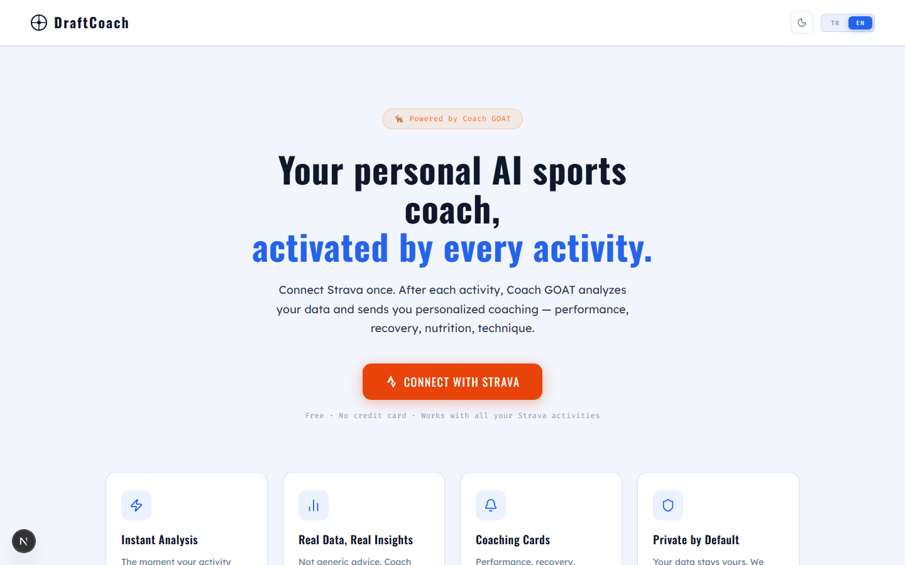
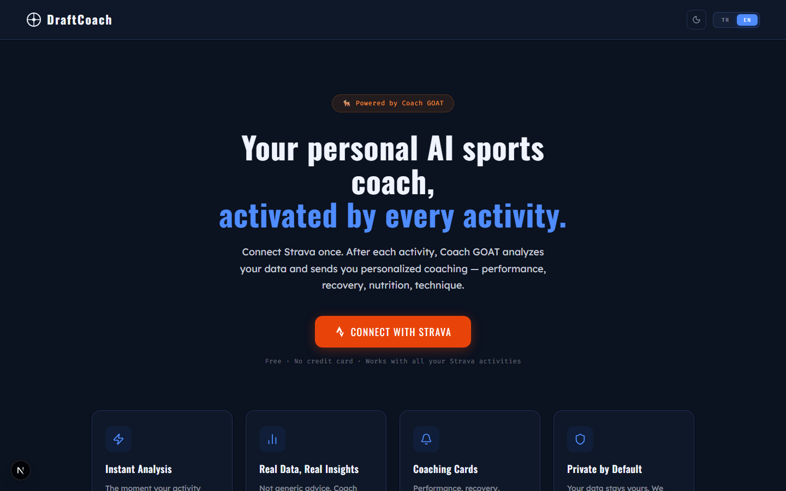

# DraftCoach — AI Sports Coach

> Connect Strava once. After every activity, Coach GOAT analyzes your data and delivers personalized coaching — performance, recovery, nutrition, technique.


---

## Screenshots

<table>
  <tr>
    <td></td>
    <td></td>
  </tr>
  <tr>
    <td align="center"><em>Landing Page — Light Mode</em></td>
    <td align="center"><em>Landing Page — Dark Mode</em></td>
  </tr>
</table>

---

## What is DraftCoach?

DraftCoach is a full-stack AI sports coaching application that integrates with Strava via webhook. Every time you finish an activity — cycling, running, swimming, hiking, strength training — **Coach GOAT** automatically analyzes your data and generates personalized coaching cards with no manual action required.

No generic advice. No manual uploads. Real numbers, real insights, delivered automatically.

---

## How It Works

```
Strava Activity Finished
        │
        ▼
Strava Webhook  ──►  Next.js API Route
        │                    │
        │            Save to Neon DB
        │                    │
        │            Call FastAPI (Groq)
        │                    │
        │            AI Coach generates cards
        │                    │
        ▼                    ▼
   Dashboard  ◄──  Coaching cards saved to DB
```

1. User connects Strava via OAuth
2. Strava sends a webhook event when a new activity is created
3. The Next.js webhook handler fetches full activity data from Strava API
4. Activity is saved to Neon PostgreSQL
5. FastAPI calls Groq (llama-3.3-70b) with sport-specific prompts
6. Personalized coaching cards are saved and displayed on the dashboard

---

## Features

- **Automatic Analysis** — No manual action needed; webhook triggers on every Strava activity
- **Multi-Sport Support** — Cycling, running, swimming, hiking, strength training and more — each with a tailored AI coach persona
- **Coach GOAT** — AI coach powered by Groq (llama-3.3-70b-versatile) with sport-specific coaching
- **Coaching Cards** — Performance, recovery, nutrition, technique, next training plan
- **Dark / Light Mode** — Full theme support with smooth transitions, persists across navigation
- **TR / EN Language** — Complete Turkish and English UI with next-intl, URL-based routing (`/tr/`, `/en/`)
- **Session Security** — Auto logout after 15 min inactivity with green/orange/red warning banners at 10/5/1 min
- **Neon PostgreSQL** — Serverless database, never pauses (unlike Supabase free tier)
- **Strava OAuth** — Secure authentication with token refresh handling

---

## Tech Stack

| Layer | Technology |
|---|---|
| Frontend | Next.js 16 (Turbopack), TypeScript |
| Internationalisation | next-intl (URL prefix routing, TR/EN) |
| Authentication | NextAuth v5 + Strava OAuth 2.0 |
| Backend | FastAPI (Python 3.12) |
| AI | Groq API — llama-3.3-70b-versatile |
| Database | Neon (serverless PostgreSQL) |
| Deployment | Vercel (frontend) + ngrok (backend tunnel) |

---

## Project Structure

```
draftcoach/
├── apps/
│   ├── api/                          # FastAPI backend
│   │   ├── main.py                   # AI coach endpoint, Groq streaming, usage tracking
│   │   └── requirements.txt
│   └── web/                          # Next.js frontend
│       ├── app/
│       │   ├── [locale]/             # TR / EN routing
│       │   │   ├── layout.tsx        # Root layout with providers
│       │   │   ├── page.tsx          # Landing page
│       │   │   └── dashboard/
│       │   │       └── page.tsx      # Activity dashboard
│       │   ├── api/
│       │   │   ├── activities/       # Activities API (auth-gated)
│       │   │   └── webhook/strava/   # Strava webhook handler
│       │   └── components/
│       │       ├── ThemeProvider.tsx # Dark/light theme context
│       │       ├── ThemeToggle.tsx
│       │       ├── LanguageToggle.tsx
│       │       └── InactivityGuard.tsx  # Auto-logout after 15 min
│       ├── i18n/
│       │   ├── routing.ts
│       │   └── request.ts
│       ├── messages/
│       │   ├── tr.json
│       │   └── en.json
│       └── lib/
│           ├── auth.ts               # NextAuth + Strava config
│           └── db.ts                 # Neon SQL client
└── schema.sql                        # Database schema (users, activities, analyses)
```

---

## Getting Started

### Prerequisites

- Python 3.12+
- Node.js 18+
- [Groq API Key](https://console.groq.com) — free
- [Neon](https://neon.tech) account — free, never pauses
- Strava API app ([developers.strava.com](https://developers.strava.com))

### 1. Database Setup

Run `schema.sql` in your Neon project's SQL Editor to create the `users`, `activities`, and `analyses` tables.

### 2. Backend

```bash
cd apps/api
pip install -r requirements.txt
uvicorn main:app --reload
# Runs on http://localhost:8000
```

### 3. Frontend

```bash
cd apps/web
npm install
npm run dev
# Runs on http://localhost:3000
```

### 4. Environment Variables

Create `apps/web/.env.local`:

```env
NEXTAUTH_SECRET=your_secret_here
NEXTAUTH_URL=http://localhost:3000

STRAVA_CLIENT_ID=your_client_id
STRAVA_CLIENT_SECRET=your_client_secret
STRAVA_WEBHOOK_VERIFY_TOKEN=your_verify_token

DATABASE_URL=postgresql://...your_neon_connection_string...

GROQ_API_KEY=gsk_...
INTERNAL_API_URL=http://localhost:8000
```

### 5. Strava Webhook (local dev)

```bash
# Expose backend with ngrok
ngrok http 8000

# Register webhook with Strava
curl -X POST https://www.strava.com/api/v3/push_subscriptions \
  -F client_id=YOUR_CLIENT_ID \
  -F client_secret=YOUR_CLIENT_SECRET \
  -F callback_url=https://YOUR_NGROK_URL/api/webhook/strava \
  -F verify_token=YOUR_VERIFY_TOKEN
```

---

## License

Copyright (c) 2026 Ceren Gültekin. All rights reserved.

This repository is publicly visible for portfolio purposes only.
Using, copying, or distributing this code without explicit written permission from the author is prohibited.

---

## Author

**Ceren Gültekin**
[LinkedIn](https://www.linkedin.com/in/ceren-g%C3%BCltekin-2a70841b3/)

---

> *"Numbers everywhere. Insight nowhere. So I built DraftCoach."*
